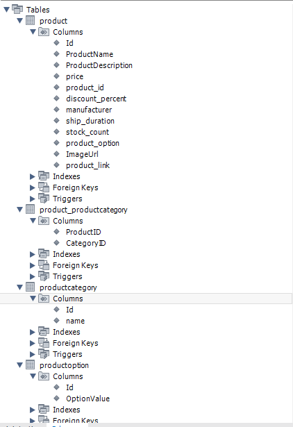

# Welcome to my chocolate webshop!

This is the backend project. The backend can be found [here](https://github.com/Cmd190/shop-backend).
Please note that this is an experimental project which I use to practice my coding skills. It's not perfect and it't not meant to be.

Technologies: C#, NET 9, ASP .Net Core Web API, Entity Framework Core, MySQL DB

## Current Features:

- API for getting categories from the DB
- API for getting products from the DB
- API for searching products by differenct criteria
- Repository pattern for db stuff abstraction and separation of api handling and db handlign

## Planned Features:

- API for authentification
- DB Schema expansion: Add user and orders
- API for placing orders
- API for posting products and categories

## Project Structure

- --Webshop
- ---- Controllers: .net core controllers providing and handling HTTP requests
- ---- DbRepository: EF implementations and abstraction layer
- ---- Models: data classes
- ---- Program.cs: standard entry point for the web server. All configuration happens here

## MySQL Database Schema

