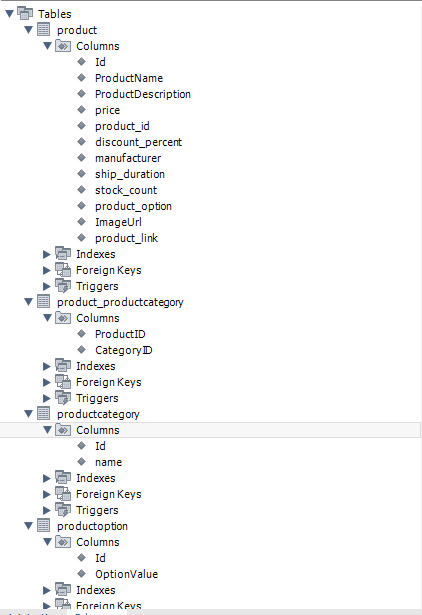

# Welcome to my chocolate webshop!

This is the backend project. The fronted can be found [here](https://github.com/Cmd190/shop-frontend).
Please note that this is an experimental project which I use to practice my coding skills. It's not perfect and it't not meant to be.

Technologies: C#, NET 9, ASP .Net Core Web API, Entity Framework Core, MySQL DB

### Authentification and Authorization:

* Both, back and frontend rely on microsoft entra for authentification
* MS Entra contains the accounts, groups, and permission mappings
* Both, the frontend react app and this backend api are registered in entra
* Only authenticated users can use the app. Using the search function requires special permissions (which all users have, but the web api server returns a 401 Unauthorized. Probably a config issue in entra or MSAL)
* The authentification follows modern security standards using OpenID Connect (OIDC) and OAuth 2.0 with the Authorization Code Flow + PKCE
* The Frontend relies on the Microsoft Authentication Library (MSAL). This has a good integration in ms entra, uses the Authorization Code Flow + PKCE and provides a layer of abstraction when it comes to authentification requests and access token handling
* For authorization a claim-based strategy is used, assigning users to groups with different permissions (Admin for read/write, User for read only)
* The backend uses the the package Microsoft.Identity.Web to simplify the communication with ms entra

#### Auth Workflow between front- and backend

* When the user visits the website of the webshop, heneeds to login using an azure account. He gets redirected to the azure login page, and gets redirected back after the login
* When the user wants to use the search function, he needs a valid authorization to do so
* For this purpose, the client requests an Access Token from entra for the scope of the web api
* This token is then included in the header of the search  fetch request to the web api
* The authentification middleware of the web api validates the received token
* The middleare maps the group claims of the requested token to the specified role claim type (see Program.cs)
* The controller checks if the user is authorized for calling an api method

## Current Features:

- API for getting categories from the DB
- API for getting products from the DB
- API for searching products by differenct criteria
- Repository pattern for db stuff abstraction and separation of api handling and db handlign

## Planned Features:

- DB Schema expansion: Add user and orders
- API for placing orders
- API for posting products and categories

## Project Structure

- --Webshop
- ---- Controllers: .net core controllers providing and handling HTTP requests
- ---- DbRepository: EF implementations and abstraction layer
- ---- Models: data classes
- ---- Program.cs: standard entry point for the web server. All configuration happens here

## MySQL Database Schema

